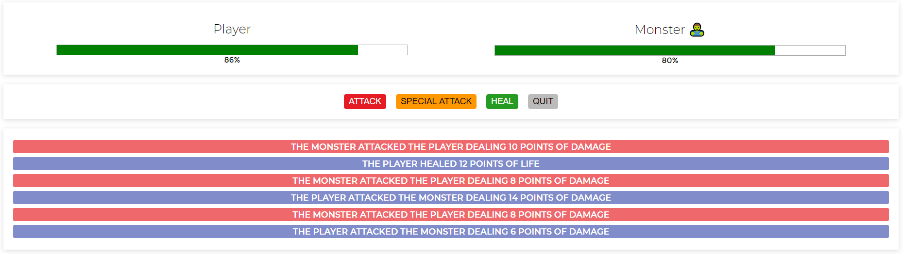
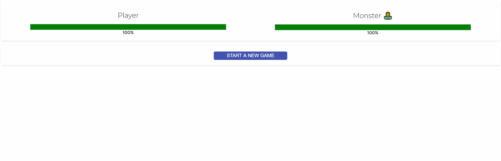

<!-- Badges session -->
<p align="center">
  
  
  <a href="https://github.com/K-Schaeffer/monster-slayer-vue/commits/master">
    
  </a>
  
  <a href="https://www.linkedin.com/in/k-schaeffer/">
    
  </a>
  
    
</p>

<p align="center">
    	
	<a href="">
    		
  	</a>

	
</p>

<!--Banner session-->
<h1 align="center">
    Monster Slayer 🧟‍♂️
</h1>

<!--Status session-->
<h4 align="center"> 
	🚧 Completed ✔️ 🚧
</h4>

<!-- Index session-->
<p align="center">
 <a href="#-about-the-project">About</a> •
 <a href="#-functionalities">Functionalities</a> • 
 <a href="#-layout">Layout</a> • 
 <a href="#-preview">Preview</a> • 
 <a href="#-knowledge-acquired">Knowledge acquired</a> • 
 <a href="#-running-the-project">Running it</a> • 
 <a href="#-technologies">Technologies</a> • 
 <a href="#-license">License</a>
</p>

<!--About session-->
## 💻 About the project

The project was developed with the guidance of a Vue.js online course.
It's main objective is to focus in the practice of some of the framework fundamentals.

Monster Slayer is a minigame that your objective is to kill the monster before he kills you.

---

<!--Functionalities session-->
## ⚙️ Functionalities

- [x] With the game initiated you can:
  - [x] strike a simple attack
  - [x] strike a special attack
  - [x] heal yourself
  - [x] watch the ocurrencies log once an event ocurred
  
---

<!--Layout session-->
## 🎨 Layout

<p align="center" style="display: flex; align-items: flex-start; justify-content: center;">
  
</p>

---

<!--Preview session-->
## 📺 Preview

<p align="center">

</p>

Play it yourself, **click [here](https://k-schaeffer.github.io/monster-slayer-vue/) :)**

---

<!--Preview session-->
## 📚 Knowledge acquired

- [x] Vue.js fundamentals such as:
  - [x] vue instance: data, methods, computed properties, watchers
  - [x] conditional rendering
  - [X] list rendering 
  - [X] data binding 
  - [X] css manipulation with Vue 

- [x] HTML tricks such as:
  - [x] template tag

---

<!--Running session-->
## 🚀 Running the project

This project has a simple structure:
1. [HTML](/index.html) 
2. [JS](/app.js) (With the Vue.js MDN already linked in the index.html)
3. [CSS](/style.css) 

<!--💡Obs-->

### Requirements

* [Git](https://git-scm.com)

#### 🎲 Running it

```bash

# Clone this repo
$ git clone https://github.com/K-Schaeffer/monster-slayer-vue.git

# Open the index.html 
$ explorer index.html

```

Opcionally, you may want to run it in the live server, so I recommend you to install the VSCODE Live Server extension and run the index.html from it. <br>
See the Useful Tools section.

---

<!--Tecnologies session-->
## 🛠 Technologies

The following tools where used in the project development:

-   **[HTML](https://developer.mozilla.org/pt-BR/docs/Web/HTML)**
-   **[CSS](https://developer.mozilla.org/pt-BR/docs/Web/CSS)**
-   **[JS](https://developer.mozilla.org/pt-BR/docs/Web/JavaScript)**
-   **[Vue.js](https://vuejs.org)**

#### **Useful tools**

-   Editor:  **[Visual Studio Code](https://code.visualstudio.com/)**  → Extensions:  **[Live Server](https://marketplace.visualstudio.com/items?itemName=ritwickdey.LiveServer)**
-   Markdown:  **[EmojiCopy](https://www.emojicopy.com)**,  **[Markdown Emoji](https://gist.github.com/rxaviers/7360908)**
-   Badges:  **[Shields.io](https://shields.io)**


<!--License session-->
## 📝 License

This project is under the [MIT](./LICENSE) license.

---

<!--Bottom session-->
<h4 align=center>Made with ❤️ by Kauan Schaeffer 👋 <a href="https://www.linkedin.com/in/k-schaeffer/">Contact me :)</a></a></h4>
